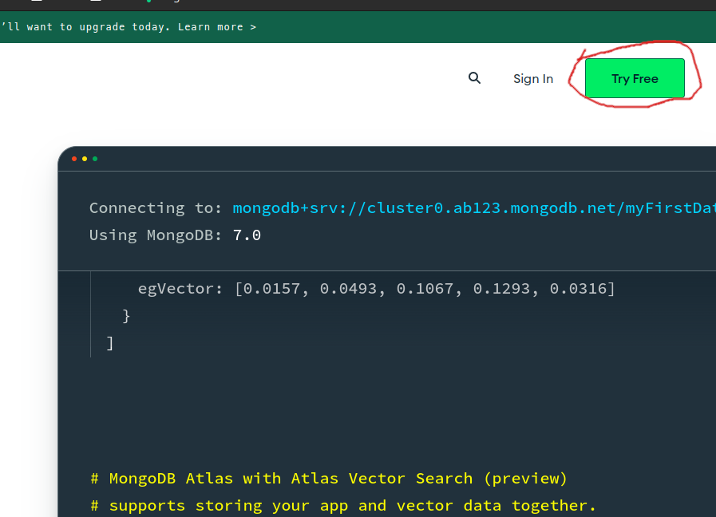
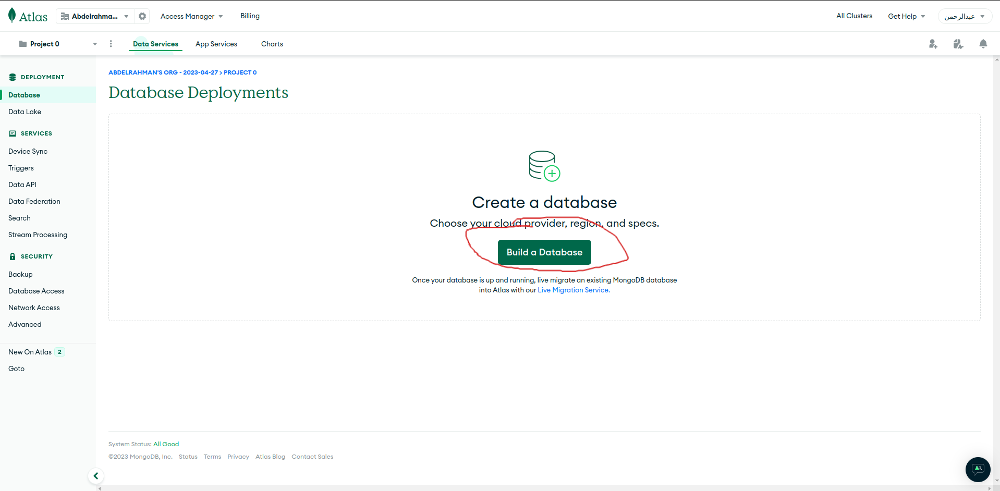
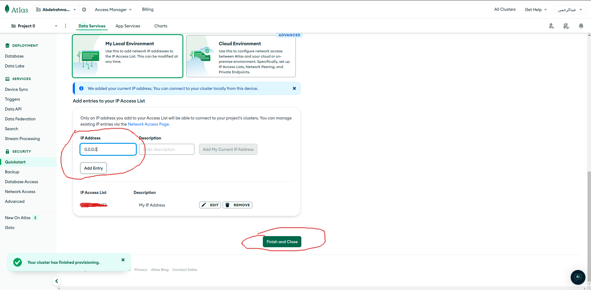

للبدأ في تثبيت النظام نحتاج أولا إلي تحميل أداة MongoDB Tools لرفع قاعدة البيانات الخاصة بالنظام وقبل ذلك ستحتاج أن تمتلك قاعدة بيانات ويمكنك الحصول علي قاعدة بيانات مجانية من موقع MongoDB أو من خلال إنشاء قاعدة بيانات علي السيرفر وسنتطرق لهذه النقطة لاحقا بإذن الله

## إنشاء قاعدة بيانات علي Mongo Atlas

أولا ستتوجه إلي هذا الموقع [من هنا](https://www.mongodb.com/) 

ومن ثم سنضغط علي Try free كما في الصورة

وستكتب بياناتك ومن ثم تنشئ الحساب.
بعد ذلك سنغط علي **Build a Database**  في الصفحة الرئيسية كما في الصورة

ومن ثم ستختر الخطة الخاصة بك ولا أنصح بالخطة المجانية إن أردت أن تحصل علي السرعة المثالية ومن ثم نضغط علي **Create** 

بعد ذلك اكتب اسم مستخدم وكلمة مرور واحفتظ بهم سنستخدمهم لاحقاً ومن ثم نضغط علي **Create user**

بعد ذلك نضيف هذا **0.0.0.0** إلي الip address ونضغط علي **Finish**

